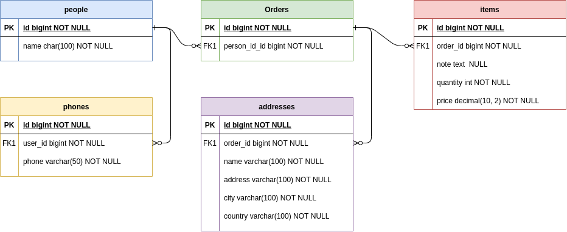

<p align="center"><a href="https://laravel.com" target="_blank"></a></p>

<p align="center">
<a href="https://packagist.org/packages/laravel/framework"></a>
</p>

# Desafio Invillia PHP
Crie um aplicativo para carregar manualmente os XMLs fornecidos e tenha a opção de processá-los de forma assíncrona. Os resultados dos dados processados devem ser registrados. Disponibilize as informações processadas por meio das APIs rest.
## Descrição:
Seu cliente recebe dois modelos XML de seu parceiro. Essas informações devem estar disponíveis para o sistema web e aplicativo móvel. O conteúdo XML pode ser muito extenso e devemos garantir que o conteúdo seja totalmente processado.

### Exemplos

`people.xml`

```xml
<?xml version="1.0" encoding="utf-8"?>
<people>
	<person>
	  <personid>1</personid>
	  <personname>Name 1</personname>
	  <phones>
		<phone>2345678</phone>
		<phone>1234567</phone>
	  </phones>
	</person>
	<person>
	  <personid>2</personid>
	  <personname>Name 2</personname>
	  <phones>
		<phone>4444444</phone>
	  </phones>
	</person>
	<person>
	  <personid>3</personid>
	  <personname>Name 3</personname>
	  <phones>
		<phone>7777777</phone>
		<phone>8888888</phone>
	  </phones>
	</person>
</people>
```

`shiporders.xml`
```xml
<?xml version="1.0" encoding="utf-8"?>
<shiporders>
	<shiporder>
	  <orderid>1</orderid>
	  <orderperson>1</orderperson>
	  <shipto>
		<name>Name 1</name>
		<address>Address 1</address>
		<city>City 1</city>
		<country>Country 1</country>
	  </shipto>
	  <items>
		  <item>
			<title>Title 1</title>
			<note>Note 1</note>
			<quantity>745</quantity>
			<price>123.45</price>
		  </item>
	  </items>
	</shiporder>
	<shiporder>
	  <orderid>2</orderid>
	  <orderperson>2</orderperson>
	  <shipto>
		<name>Name 2</name>
		<address>Address 2</address>
		<city>City 2</city>
		<country>Country 2</country>
	  </shipto>
	  <items>
		  <item>
			<title>Title 2</title>
			<note>Note 2</note>
			<quantity>45</quantity>
			<price>13.45</price>
		  </item>
	  </items>
	</shiporder>
	<shiporder>
	  <orderid>3</orderid>
	  <orderperson>3</orderperson>
	  <shipto>
		<name>Name 3</name>
		<address>Address 3</address>
		<city>City 3</city>
		<country>Country 3</country>
	  </shipto>
	  <items>
		  <item>
			<title>Title 3</title>
			<note>Note 3</note>
			<quantity>5</quantity>
			<price>1.12</price>
		  </item>
		  <item>
			<title>Title 4</title>
			<note>Note 4</note>
			<quantity>2</quantity>
			<price>77.12</price>
		  </item>
	  </items>
	</shiporder>
</shiporders>
```
## Base de dados



## Instalação

Instale as dependências do framework:

`composer install`

Copie o arquivo de exemplo de configuração `.env.example` para `.env` e edite as variáveis relacionadas ao banco de dados:  

`cp .env.example .env `

Gere uma nova chave para aplicação:

`php artisan key:generate`

Gere o token do JWT:

`php artisan jwt:secret`

Faça a migração e popule o seu banco de dados:

`php artisan migrate --seed`

Habilite uma conta do Gmail para receber o notificações do sistema `https://myaccount.google.com/lesssecureapps`, e configure esse email no `.env`:

```env
MAIL_USERNAME={myemail}
MAIL_PASSWORD={passwordemail}
```

Realize o comando abaixo para habilitar as execuções de jobs em background:

`php artisan queue:work --queue=uploading`

Por último, para testar a api configure o Postmam com a coleção `assets/invillia.postman_collection.json` e as variáveis de ambiente `assets/invillia.postman_environment.json`. 

### Lista de possíveis rotas para teste:

Operação                |      |  Entrada              | Saída | Header  | Middleware |
------------------------|------|-----------------------|-------|---------|------------|
**/**                   | GET  |                       | frontend   				|        | web | 
**/people**             | POST |     File*             | frontend   				|        | web | 
**/orders**             | POST |     File*             | frontend   				|        | web | 
**/api/addresses**      | GET  |                       | (lista de endereços)      	| token* | api |
**/api/addresses/{id}** | GET  |                       | (busca enredeço pelo id)  	| token* | api |
**/api/items**          | GET  |                       | (lista de itens)			| token* | api |
**/api/items/{id}**     | GET  |                       | (busca item pelo id) 		| token* | api |
**/api/orders**         | GET  |                       | (lista de pedidos) 		| token* | api |
**/api/orders/{id}**    | GET  |                       | (busca pedido pelo id)		| token* | api |
**/api/people**         | GET  |                       | (lista de pessoas)			| token* | api |
**/api/people/{id}**    | GET  |                       | (busca pessoa pelo id)		| token* | api |
**/api/phone**          | GET  |                       | (lista de telefones)		| token* | api |
**/api/phone/{id}**     | GET  |                       | (busca telefone pelo id)	| token* | api |
**api/auth/login**		| POST | email* password*	   | (token)					|		 | api |
**api/auth/register**	| POST | email* password*	   | (dados de cadastro)		|		 | api |
**api/auth/logout**		| POST | 					   |							| token* | api |
**api/auth/refreshToken**| POST | 					   |							| token* | api |
**api/auth/confirm-account/{token}**| GET | 		   | 							| 		 | api |

## Considerações Finais

### Implementações Atuais
  - MVCS (Model View Controller Service)
  - Template Method
  - DI (Dependency Injection)
  - JWT (Json Web Token)
  - Middlewares
  - JsonResource
  - Handle Transaction
  - Handle Exceptions
  - Queue Jobs
### Implementações Futuras
  - TDD
  - Migrations
  - Documentation
  - Docker Image
  - Mails